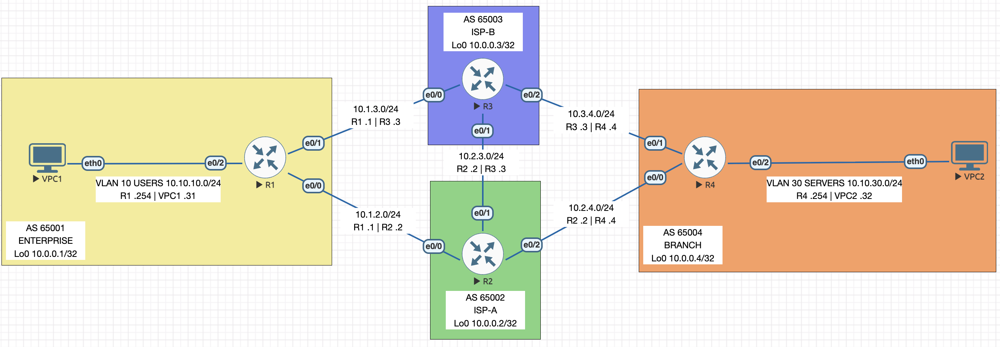

# BGP — eBGP, Best Path Selection and PBR

Import [`bgp.unl`](bgp.unl) to build this topology — nodes and cabling only.

ENCOR 3.2.c/d · 4 IOL L3 routers + 2 VPCS · Sep 2026

## Addressing

| Subnet / AS | Name | Who uses it |
|---|---|---|
| AS 65001–65004 | one AS per router | R1 enterprise, R2 ISP-A, R3 ISP-B, R4 branch |
| 10.1.2.0/24, 10.1.3.0/24 | enterprise uplinks | R1–R2, R1–R3 |
| 10.2.3.0/24 | ISP-to-ISP peering | R2–R3 |
| 10.2.4.0/24, 10.3.4.0/24 | branch uplinks | R2–R4, R3–R4 |
| 10.0.0.0/8 | Loopback0 | `10.0.0.<num>/32`, one per router — also the BGP router ID |
| 10.10.10.0/24 | USERS | R1 `.254`, VPC1 `.31` |
| 10.10.30.0/24 | SERVERS | R4 `.254`, VPC2 `.32` |

Last octet is the device number, gateway `.254`. No IGP anywhere — every peer is directly
connected, so every next hop sits on a connected subnet.

## Links

| Link | Interfaces | Type |
|---|---|---|
| R1–R2 | Et0/0 both ends | eBGP, enterprise to ISP-A |
| R1–R3 | Et0/1 → Et0/0 | eBGP, enterprise to ISP-B |
| R2–R3 | Et0/1 both ends | eBGP, ISP to ISP |
| R2–R4 | Et0/2 → Et0/0 | eBGP, ISP-A to branch |
| R3–R4 | Et0/2 → Et0/1 | eBGP, ISP-B to branch |
| R1–VPC1, R4–VPC2 | Et0/2 | host LANs |

Every AS holds exactly one router, so all five sessions are eBGP over a single hop.

## Configured

- BGP in each router's own AS, router ID set explicitly from Loopback0, five Established
  sessions carrying nothing before any prefix is originated
- Every router originates its Loopback0 `/32`; R1 originates `10.10.10.0/24` and R4
  `10.10.30.0/24`. All by `network` statement with an explicit mask — nothing redistributed
- `ISP-A-IN` sets local preference 200 on everything R1 learns from ISP-A, so the
  enterprise leaves via ISP-A while both paths stay in the table
- `PREPEND-ISP-B` prepends 65001 twice to `10.10.10.0/24` outbound to ISP-B, which drops
  its own direct link in favour of ISP-A — return traffic then matches the outbound choice
- PBR on R1 sending VPC1's traffic for `10.10.30.0/24` out of the ISP-B link, compared
  against an unchanged routing table, then removed

## Faults diagnosed

| Symptom | Cause |
|---|---|
| ISP-B–branch session never came up, everything still reachable through ISP-A | R4 peering with 10.3.4.30, not the ISP's interface address |
| VPC1 cut off and 10.10.10.0/24 gone from every other AS, R1's sessions still up | R1's LAN interface shut, so the connected route the network statement needs was gone |
| Enterprise LAN unreachable from outside AS 65001, R1 itself fine | R1's network statement for 10.10.10.0/24 removed |
| Branch LAN missing everywhere outside AS 65004, R4 still configured for it and silent | R4's network statement masked 255.255.0.0, matching no route in its table |
| Traffic to the branch left through ISP-B, return traffic still arrived through ISP-A | `ISP-A-IN` setting local preference 50, below the default 100 |
| Best path via ISP-B while the ISP-A paths still showed local preference 200 | weight 500 on R1's ISP-B neighbor, compared before local preference |
| Prepend policy quietly stopped working, R1 unchanged | R2's interface toward R3 shut, removing ISP-B's better alternative |
