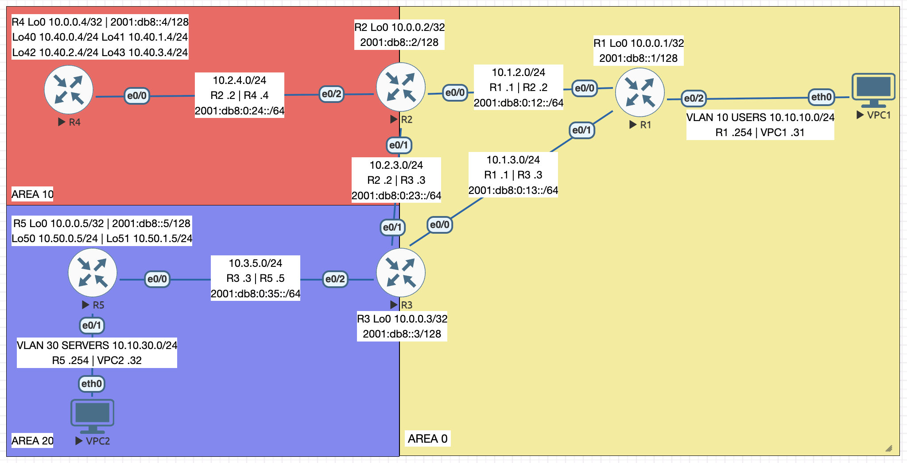

# IGP — OSPFv2, OSPFv3, Multi-Area and Filtering

Import [`igp.unl`](igp.unl) to build this topology — nodes and cabling only.

ENCOR 3.2.a/b · 5 IOL L3 routers + 2 VPCS · Sep 2026

## Addressing

| Subnet | Name | Who uses it |
|---|---|---|
| 10.1.2.0/24, 10.1.3.0/24, 10.2.3.0/24 | backbone triangle | R1–R2, R1–R3, R2–R3 |
| 10.2.4.0/24 | area 10 uplink | R2–R4 |
| 10.3.5.0/24 | area 20 uplink | R3–R5 |
| 10.0.0.0/8 | Loopback0 | `10.0.0.<num>/32`, one per router — also the router ID |
| 10.40.0.0/22 | branch subnets | four contiguous /24 loopbacks on R4 |
| 10.50.0.0/24, 10.50.1.0/24 | downstream subnets | loopbacks on R5 |
| 10.10.10.0/24 | USERS | R1 `.254`, VPC1 `.31` |
| 10.10.30.0/24 | SERVERS | R5 `.254`, VPC2 `.32` |

Last octet is the device number, gateway `.254`. OSPFv3 runs over a parallel
`2001:db8:0:<link>::/64` on every router-to-router link with `2001:db8::<num>/128`
loopbacks; the two host LANs stay IPv4-only.

## Links

| Link | Interfaces | Type |
|---|---|---|
| R1–R2 | Et0/0 both ends | area 0, broadcast |
| R1–R3 | Et0/1 → Et0/0 | area 0, broadcast, cost 100 — the slow path |
| R2–R3 | Et0/1 both ends | area 0, point-to-point |
| R2–R4 | Et0/2 → Et0/0 | area 10 |
| R3–R5 | Et0/2 → Et0/0 | area 20 |
| R1–VPC1, R5–VPC2 | Et0/2, Et0/1 | host LANs |

## Configured

- OSPFv2 process 1 on all five routers, router ID set explicitly from Loopback0; R1's
  user LAN advertised but passive
- R2 summarizes R4's four branch /24s into the backbone as `10.40.0.0/22`
- R3 holds `10.50.1.0/24` inside area 20 with an `AREA20-OUT` prefix list on the area
  filter-list — the route stays in R3's own table
- OSPFv3 over the same five routers and the same three areas, matching router IDs
  (traditional `ipv6 router ospf`; this image predates address-family syntax)
- EIGRP AS 100 across the backbone, left running on top of OSPF so the two could be
  compared on metric, database and path selection, then removed

## Faults diagnosed

| Symptom | Cause |
|---|---|
| R1–R2 adjacency gone, link up and pingable both ways | R2's interface toward R1 made passive |
| R2–R3 adjacency dropped and never returned | hello interval 5 on one end, 10 on the other |
| R1 and R3 stuck short of FULL, cycling | IP MTU 1400 on R3's end only |
| All of area 10 vanished at once, area 20 untouched | R4's uplink administratively shut |
| R4 and R2 would not form an adjacency, timers matched | R4's uplink moved to area 1, R2 still area 10 |
| Everything reachable, but R1's first hop moved to the slow link | cost 500 on R1's interface toward R2 |
| R2–R3 FULL yet the link carried nothing | one end broadcast, the other point-to-point |
| Branch subnets unreachable, R4 and its loopback fine | area 10 range set to not-advertise |
| VPC1 lost VPC2 while R3 kept it | a deny for the server LAN inserted ahead of `AREA20-OUT` |
| Only R1 lost the branch subnets — every other router had them | inbound distribute-list denying `10.40.0.0/22` under R1's OSPF |
| IPv4 to area 20 fine, R5's IPv6 loopback unreachable | OSPFv3 removed from R5's uplink |
