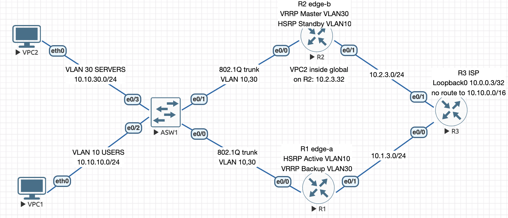

# IP Services — NAT/PAT and First Hop Redundancy

Import [`ip-services.unl`](ip-services.unl) to build this topology — nodes and cabling only.

ENCOR 3.3.b/c · 3 IOL L3 routers + 1 IOL L2 switch + 2 VPCS · Sep 2026

## Addressing

| Subnet | Name | Who uses it |
|---|---|---|
| VLAN 10 · 10.10.10.0/24 | USERS | R1 `.1`, R2 `.2`, HSRP VIP `.254`, VPC1 `.31` |
| VLAN 30 · 10.10.30.0/24 | SERVERS | R1 `.1`, R2 `.2`, VRRP VIP `.254`, VPC2 `.32` |
| 10.1.3.0/24 | R1 uplink | R1 `.1`, R3 `.3` |
| 10.2.3.0/24 | R2 uplink | R2 `.2`, R3 `.3`, `10.2.3.32` the server's inside global |
| 10.0.0.3/32 | R3 Loopback0 | the outside target |

R3 is the ISP and holds no route to `10.10.0.0/16` — only translated traffic is answered.

## Links

| Link | Interfaces | Type |
|---|---|---|
| ASW1–R1, ASW1–R2 | Et0/0 → Et0/0, Et0/1 → Et0/0 | 802.1Q trunk, VLANs 10 and 30, dot1Q subinterfaces |
| ASW1–VPC1, ASW1–VPC2 | Et0/2, Et0/3 | access, VLAN 10 and VLAN 30 |
| R1–R3, R2–R3 | Et0/1 → Et0/0, Et0/1 → Et0/1 | routed, NAT outside |

Each edge router has one static default route to R3. No IGP.

## Configured

- HSRP version 2, group 10, for VLAN 10: R1 Active at priority 110, both routers preempt
- R1's HSRP group tracks its ISP link with a decrement of 20, landing it at 90, below R2's 100
- VRRP group 30 for VLAN 30: R2 Master at priority 110, so each router forwards one VLAN
- PAT on both edge routers: standard ACL `NAT-INSIDE`, sequence 10 for VLAN 10 and 20 for
  VLAN 30, overloaded onto the router's outside interface
- Static NAT on R2, VLAN 30's VRRP Master: `10.10.30.32` ↔ `10.2.3.32`, reachable from
  the ISP without the server sending first

## Faults diagnosed

| Symptom | Cause |
|---|---|
| Both routers HSRP Active for VLAN 10, no peer, VLAN 30 fine | VLAN 10 pruned from ASW1's trunk to R2 |
| Both routers HSRP Active for VLAN 10, trunks and pings fine | R2 back on HSRP version 1, R1 on version 2 |
| R2 forwarding VLAN 10, group healthy at both ends | R1's HSRP priority 110 removed, tie broken by address |
| R2 forwarding VLAN 10, R1's ISP link up and priority still 110 | second tracked interface, unconnected and down, holding R1 at 90 |
| R2 forwarding VLAN 10, users unaffected, R1 cannot reach the ISP | R1's ISP link shut, tracking failover working as designed |
| VPC1 cannot reach the ISP, its gateway can | `ip nat inside` missing on R1's VLAN 10 subinterface |
| VPC1 cannot reach the ISP, no translation, nothing logged | `NAT-INSIDE` sequence 10 deleted |
| Nothing behind R2 reaches the ISP, R2 itself does | `ip nat outside` missing on R2's ISP link |
| ISP gets no ARP reply for `10.2.3.32` | static mapping removed from R2 |
| R2 answers for `10.2.3.32`, server still unreachable inbound | static mapping pointed at `10.10.30.99` |
| Static mapping intact, server's replies never reach the ISP | R1's VRRP priority 120 took Master, replies left through R1 and were overloaded |
