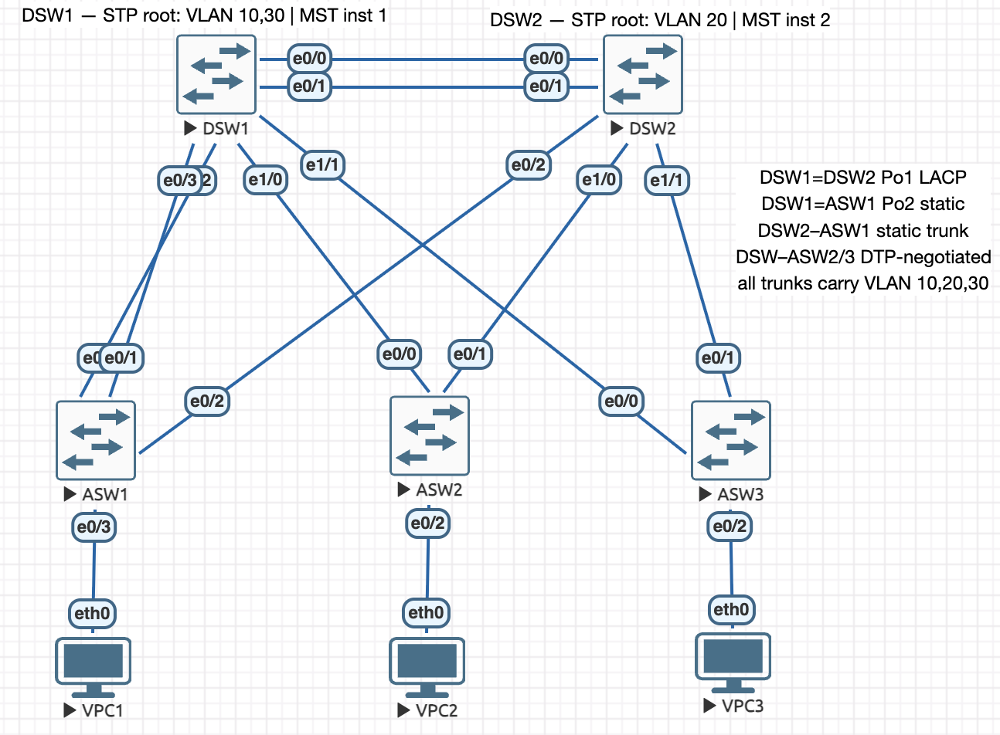

# Layer 2 — VLANs, Trunking, EtherChannel, STP

Import [`layer2.unl`](layer2.unl) to build this topology — nodes and cabling only.

ENCOR 3.1.a/b/c · 5 IOL switches + 3 VPCS · Sep 2026

## Addressing

| VLAN | Name | Hosts |
|---:|---|---|
| 10 | USERS | VPC1–3, 10.10.10.31–33/24 |
| 20 | VOICE | trunk-only |
| 30 | SERVERS | trunk-only |

Pure Layer 2 — no SVIs, no gateway. All three hosts sit in one subnet, so a ping between
them tests the Layer 2 path and nothing else.

## Links

| Link | Interfaces | Type |
|---|---|---|
| DSW1–DSW2 | Et0/0–0/1 both ends | Po1, LACP |
| DSW1–ASW1 | Et0/2–0/3 → Et0/0–0/1 | Po2, static |
| DSW2–ASW1 | Et0/2 → Et0/2 | static trunk |
| DSW1/DSW2–ASW2 | Et1/0 → Et0/0, Et0/1 | negotiated trunk |
| DSW1/DSW2–ASW3 | Et1/1 → Et0/0, Et0/1 | negotiated trunk |
| ASW1/ASW2/ASW3–VPCs | Et0/3, Et0/2, Et0/2 | access, VLAN 10 |

All trunks carry VLANs 10, 20 and 30 only.

## Configured

- Rapid PVST+ — DSW1 root for VLAN 10/30, DSW2 for VLAN 20, each backup for the other's
- Root guard on distribution downlinks, BPDU guard and portfast on host ports
- MST region CCNP rev 1 — instance 1 VLANs 10/30, instance 2 VLAN 20

## Faults diagnosed

| Symptom | Cause |
|---|---|
| ASW2 uplink stopped carrying VLANs, nothing logged | `nonegotiate` suppressed DTP, far end stayed access |
| Po2 forwarding at half capacity, stray Po3 appeared | a member was in the wrong channel-group |
| Po1 never bundled, members up | both ends LACP passive |
| One link logged a repeating native VLAN mismatch, traffic mostly fine | native VLAN 500 set on one end only |
| VPC2 unreachable, the other two hosts fine | VLAN 10 deleted on ASW2 |
| VPC2 kept connectivity but lost its shortest path | VLAN 10 pruned from a trunk's allowed list |
| VPC3 unreachable, link up and address unchanged | access port moved to VLAN 20 |
